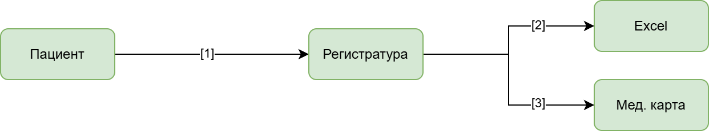
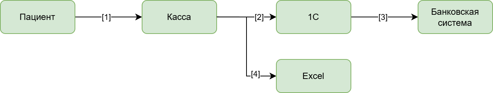

[на главную](../README.md) | [к заднию 2](../Exc2/README.md)

---

## 1. Потоки данных

### 1.1 Запись на прием

Персональные данные:
- ФИО;
- контакты;
- адрес.

[Диаграмма процесса "Запись на прием"](./dataflow_0_make_appointment.drawio)

Пояснения к диаграмме:
1. пациент сообщает данные сотруднику регистратуры;
2. сотрудник фиксирует данные в Excel. Ограничение доступа паролем, шифрование 
хранилища, обезличивание (вместо перс. данных указать номер мед. карты);
3. сотрудник фиксирует данные в мед. карте. Ограничение физического доступа к картам.

### 1.2 Обработка анализов

Медицинские данные:
- хронические заболевания;
- результаты анализов;
- диагнозы.

[Диаграмма процесса "Обработка анализов"](./dataflow_1_handle_tests.drawio)

Пояснения к диаграмме:
1. сообщает данные о необходимости проведения анализов;
2. сотрудник лаборатории формирует документ с результатами;
3. сотрудник сохраняет файл на сервер. Шифрование файлов алгоритмом AES-256 тегирование (Medical);

### 1.3 Оплата услуг

Медицинские данные:
- хронические заболевания;
- результаты анализов;
- диагнозы.

[Диаграмма процесса "Оплата услуг"](./dataflow_2_handle_payments.drawio)

Пояснения к диаграмме:
1. сообщает предоставляет квитанцию на оплату;
2. сотрудник заносит данные платежа в 1C. Ограничение доступа к системе 1С ролевой моделью;
3. 1C через интеграцию передает данные банку. Шифрование при передаче алгоритмом TLS последней версии, токенизация;
4. сотрудник дублирует данные о платеже в Excel. Ограничение доступа к файлам.

## 2. Аудит мер безопасности

### Сопоставление процессов с требованиями безопасности

| **Процесс**        | **Требования**                                 | **Соответствие** |
|--------------------|------------------------------------------------|------------------|
| Запись на приём    | Ограничение доступа, шифрование данных.        | Нет              |
| Оплата услуг       | Логирование действий, шифрование при передаче. | Частично         |
| Обработка анализов | Шифрование файлов, разграничение прав доступа. | Нет              |

### Проблемные зоны
1. **Отсутствие контроля доступа:**
    - Доступ к данным пациентов не ограничен ролями.
2. **Слабая защита файлов:**
    - Данные хранятся в открытом виде (Excel, PDF).
3. **Нет мониторинга и аудита:**
    - Не отслеживаются действия с данными.
4. **Ручная обработка:**
    - Высокий риск утечек и ошибок.

## 3. Улучшение и защита данных
### 3.1 Методы защиты

| **Данные**  | **Методы**                      |
|-------------|---------------------------------|
| ФИО         | Шифрование, ограничение доступа |
| Контакты    | Обезличивание, шифрование       |
| Медицинские | Обфускация, тегирование         |
| Финансовые  | Шифрование, токенизация         |

### 3.2 Разработка механизма тегирования данных

#### 3.2.1 Категории тегов:

`PII` (персональные данные).

`Sensitive` (чувствительные данные).

`Confidential` (конфиденциальные данные).

`Medical` (медицинская информация).

#### 3.2.2 Инструмент для тегирования

**DataGrail** - в случае MVP подходит лучше всего, т. к. позволяет отслеживать путь данных в реальном времени и имеет готовые коннекторы для подключения к PostgreSQL.

### 3.3 Рекомендации по улучшению

#### 3.3.1 Шифрование данных:

Применение Transparent Data Encryption (TDE) для базы данных.

Шифрование файлов на уровне хранилища.

#### 3.3.2 Обезличивание данных:

Удаление идентификаторов для аналитики.

Использование псевдонимизации.

#### 3.3.3 Ограничение доступа:

Внедрение ролевой модели (RBAC).

Двухфакторная аутентификация.

---
[на главную](../README.md) | [к заднию 2](../Exc2/README.md)
