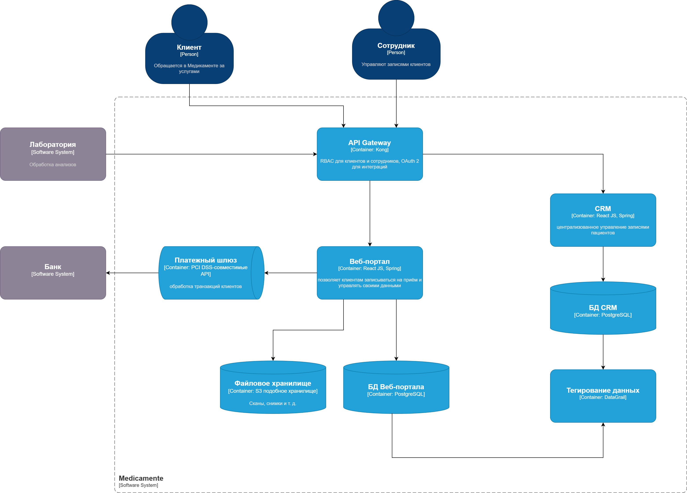

[на главную](../README.md) | [к заднию 1](../Exc1/README.md)

---

[Диаграмма контейнеров](./c4_container_to_be_arch.drawio)

- *Веб-портал для клиентов*: позволяет клиентам записываться на приём и управлять своими данными.
    - *Хранение данных*: PostgreSQL с включённым шифрованием (TDE), шифрование файлов AES-256.
    - *Передача данных*: защищённые каналы (TLS 1.3), API Gateway с аутентификацией.
    - *Сроки хранения*: данные удаляются через 1 год после завершения услуг или по запросу клиента.
    - *Защита данных*: шифрование. Доступ только к своей информации. Тегирование чувствительных данных (PII, Medical).
- *CRM для сотрудников ресепшена*: централизованное управление записями пациентов.
    - *Хранение данных*: централизованная база данных.
    - *Передача данных*: защищённый API Gateway с аутентификацией.
    - *Сроки хранения*: финансовые данные — 5 лет, записи клиентов — 1 год.
    - *Защита данных*: ролевой доступ (RBAC), шифрование данных на уровне базы.
- *Платёжный шлюз*: обработка транзакций клиентов.
    - *Хранение данных*: не хранит данные карты, использует токенизацию.
    - *Передача данных*: взаимодействие через PCI DSS-совместимые API.
- *Интеграция с лабораторией анализов*: получение данных о результатах.
    - *Передача данных*: шифрование (TLS 1.3), проверка авторизации, OAuth 2.
    - *Защита данных*: строгие контракты API, минимизация объёма передаваемой информации.

---
[на главную](../README.md) | [к заднию 1](../Exc1/README.md)
